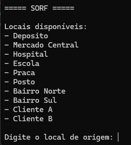
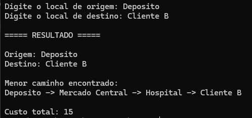

# E3 — MVP: Núcleo Funcional com Primeiras Telas

> **Disciplina:** Teoria dos Grafos  
> **Prazo:** 10 de maio de 2026  
> **Peso:** 25% da nota final  

---

## Identificação do Grupo

| Campo | Preenchimento |
|-------|---------------|
| Nome do projeto | SORF (Sistema de Otimização de Rotas com Grafos) |
| Repositório GitHub | https://github.com/VictorSunn/SORF-PROJETO-TEORIA-DOS-GRAFOS |
| Integrante 1 | Vinícius da Silva Cardoso — 40373924 |
| Integrante 2 | Victor Alexandre Dorea Randis — 38470071 |


## 1. Como Executar o MVP

> Instruções para executar o projeto SORF do zero.  
> O sistema utiliza grafos ponderados e o algoritmo de Dijkstra para calcular o menor caminho entre dois pontos da cidade fictícia.


**Pré-requisitos:**

```bash
# Necessário possuir instalado:
Python 3.13+
Git


```

**Instalação:**

```bash
# Clonar o repositório
git clone https://github.com/VictorSunn/SORF-PROJETO-TEORIA-DOS-GRAFOS
# Entrar na pasta do projeto
cd SORF-PROJETO-TEORIA-DOS-GRAFOS

# Instalar dependências
pip install -r requirements.txt

```

**Execução:**

```bash
# Comando para executar o MVP
python -m src.main

```

**Saída esperada:**


 ```
 ===== SISTEMA SORF =====

Locais disponíveis no mapa:

- Deposito
- Mercado Central
- Bairro A
- Bairro B
- Hospital
- Cliente A
- Cliente B

Digite o local de origem:
Deposito

Digite o local de destino:
Cliente B

Calculando menor rota...

===== RESULTADO =====

Origem: Deposito
Destino: Cliente B

Menor caminho encontrado:
Deposito -> Mercado Central -> Praca -> Posto -> Cliente B

Custo total: 15

```

## 2. Algoritmo Implementado

| Campo | Resposta |
|-------|----------|
| Nome do algoritmo | Dijkstra |
| Arquivo de implementação | src/algorithms/dijkstra.py |
| Complexidade de tempo | O(V²) |
| Complexidade de espaço | O(V + E) |

**Trecho do código com comentário de Big-O:**

```python
while unvisited:
    # O(V) -> percorre os vértices não visitados
    current = min(unvisited, key=lambda node: distances[node])

    unvisited.remove(current)

    # O(E) -> percorre os vizinhos do vértice atual
    for neighbor, weight in graph.get_neighbors(current):

        new_distance = distances[current] + weight

        # O(1) -> comparação e atualização da menor distância
        if new_distance < distances[neighbor]:
            distances[neighbor] = new_distance
            previous[neighbor] = current
```

## 3. Estrutura do Repositório

> Confirme que a estrutura implementada está de acordo com o E2.

```
nome-do-projeto/
├── src/
│   ├── core/
│   ├── algorithms/
│   ├── io/
│   └── main.py
├── tests/
├── data/
└── requirements.txt
```

**Desvios em relação ao E2** *(se houver)*:

- A pasta originalmente definida como `io/` no E2 foi renomeada para `loader/`, tornando mais específica a responsabilidade do módulo responsável pela leitura e carregamento dos arquivos JSON do grafo.

## 4. Telas do MVP

> Insira screenshots ou gravações da interface funcionando.

### Tela de Entrada



*A Tela inicial do sistema SORF executado via terminal, permitindo ao usuário visualizar os locais disponíveis no grafo e informar os vértices de origem e destino para cálculo da menor rota.*

### Tela de Resultado



*Resultado gerado após a execução do algoritmo de Dijkstra, exibindo o menor caminho encontrado entre os pontos selecionados e o custo total da rota calculada.*

# 5. Testes Unitários

| Algoritmo | Caso de teste | Status | Comando para executar |
|-----------|--------------|--------|----------------------|
| Dijkstra | Caso base | ✅ | `python -m pytest tests/test_algorithms.py::test_base_case` |
| Dijkstra | Grafo vazio | ✅ | `python -m pytest tests/test_algorithms.py::test_empty_graph` |
| Dijkstra | Grafo completo | ✅ | `python -m pytest tests/test_algorithms.py::test_complete_graph` |

**Como rodar todos os testes:**

```bash
python -m pytest tests/
```

**Resultado atual:**

```
============================= test session starts =============================

platform win32 -- Python 3.13.13, pytest-9.0.3

collected 3 items

tests/test_algorithms.py ...                         [100%]

============================== 3 passed ==============================
```

## 6. Histórico de Commits

> Liste os 5+ commits mais relevantes desta entrega.

| Hash (7 chars) | Mensagem | Autor |
|----------------|----------|-------|
| `fcead8f` | EXPLICAÇÃO SOBRE O FUNCIONAMENTO DO PROJETO | VictorSunn |
| `344dc2c` | EXPLICAÇÃO SOBRE O FUNCIONAMENTO DO PROJETO | VictorSunn |
| `1b9e0db` | Add GitHub repository link for SORF project | VictorSunn |
| `abcfc56` | Add files via upload | VictorSunn |
| `0edd650` | Add files via upload | VictorSunn |
| `7ea5943` | Initial commit | VictorSunn |

---

## 7. O que está funcionando / O que ainda falta

| Funcionalidade | Status | Observação |
|---------------|--------|------------|
| Classe do grafo | ✅ Completo | Estrutura implementada utilizando lista de adjacência com suporte para vértices e arestas ponderadas |
| Algoritmo principal | ✅ Completo | Algoritmo de Dijkstra implementado e funcional para cálculo do menor caminho |
| Leitura de arquivo | ✅ Completo | Sistema realiza leitura do grafo via arquivo JSON localizado na pasta `data/` |
| Tela de entrada | ✅ Completo | Interface CLI permite entrada de origem e destino via terminal |
| Tela de resultado | ✅ Completo | Sistema exibe rota calculada e custo total da menor rota |
| Testes unitários | ✅ Completo | Casos de teste implementados para cenário base, grafo vazio e grafo completo |

## Checklist de Entrega

- [ x ] Repositório público e acessível
- [ x ] .gitignore configurado
- [ x ] README com instruções de execução do MVP
- [ x ] Algoritmo principal executando sem erros
- [ x ] Tela de entrada e tela de resultado demonstráveis
- [ x ] 3 testes unitários por algoritmo (mínimo caso base passando)
- [ x ] ≥ 5 commits com prefixos semânticos (feat:, fix:, test:, docs:)
- [ x ] Ao menos 1 arquivo de grafo de exemplo em `data/`

-
*Teoria dos Grafos — Profa. Dra. Andréa Ono Sakai*
